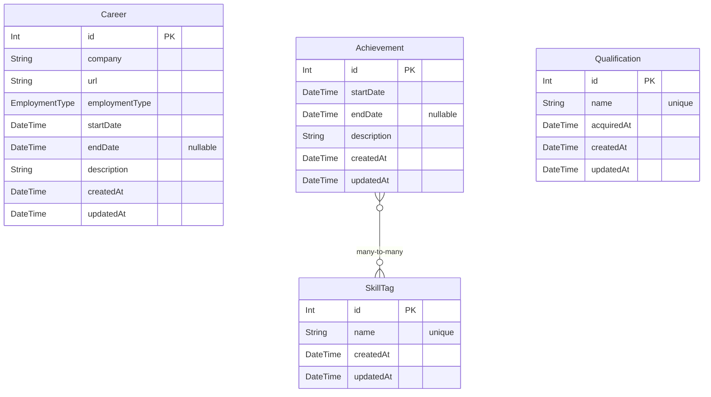

# Detail Design (詳細設計書)

- [基本設計](./2_bd.md)で決めた内容をエンジニアが実装できるレベルまで具体化

## ディレクトリ構造

- 基本概念は**feature-based**

```sh
.
├── docs # Documents
├── prisma # DB schema
├── public
├── README.md
├── src
│   ├── app # Next.js App Router（ルーティング）
│   ├── features # 機能別
│   ├── scripts # スクリプト
│   └── shared # 共通
│       ├── components # 共通コンポーネント
│       ├── constants # 定数
│       └── lib # ユーティリティライブラリ
├── supabase # Local DB
└── tsconfig.json
```

Ref: `tree -I node_modules`

## DBテーブル設計



## API仕様

エンドポイント一覧、リクエスト/レスポンス型、認証、バリデーションルール。
例: GET /api/career, POST /api/achievement など。

## 画面設計

UIコンポーネント構成、レイアウト、状態管理、イベントフロー。
例: プロフィール画面、キャリア一覧画面の構成。

## 業務ロジック

処理フロー、アルゴリズム、エラーハンドリング方針。
例: キャリア登録時のバリデーション、エラー表示。

## 外部連携

外部サービス・APIとのインターフェース仕様。
例: 認証サービス、メール送信APIなど。

## セキュリティ設計

認証・認可、入力値検証、環境変数管理。
例: JWT認証、XSS/CSRF対策。

## パフォーマンス・アクセシビリティ・テスト方針

パフォーマンス要件、アクセシビリティ対応、テスト戦略。
例: レスポンス時間、E2Eテスト、ユニットテスト方針。
