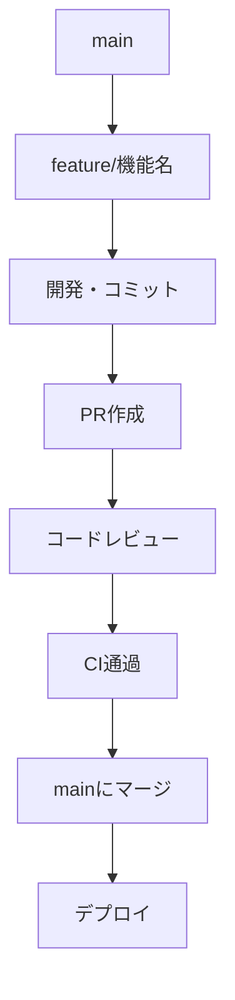
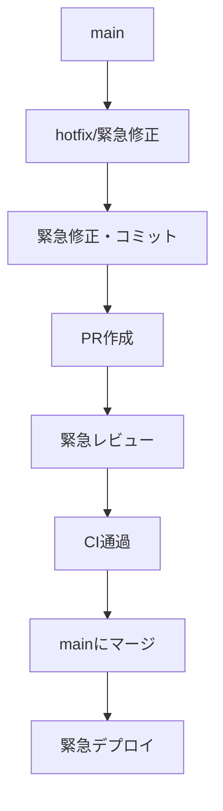
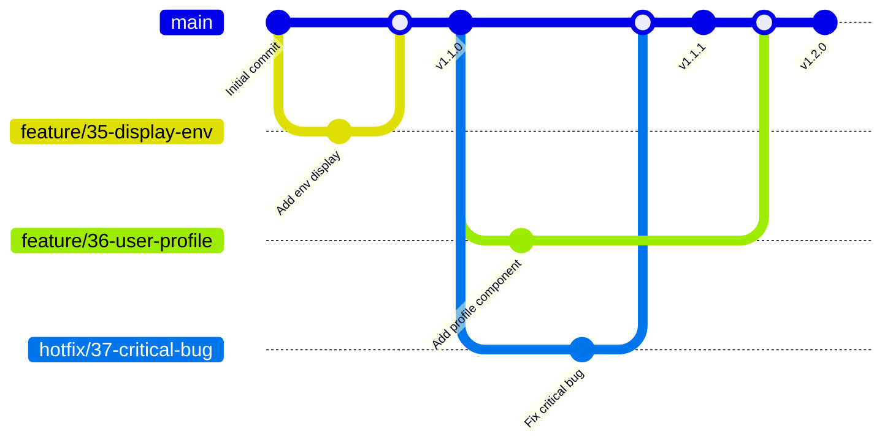

# Develop flow

## 概要

- 開発フローについて記述

## 機能開発フロー

### 基本的な開発フロー

### 緊急修正フロー

## ブランチ戦略

### GitHub Flow

- このプロジェクトでは、**GitHub Flow**をベースとしたシンプルで効率的なブランチ戦略を採用しています。

#### ブランチのライフサイクル

## ブランチ命名規則

| プレフィックス | 用途 | 例 |
| -- | -- | -- |
| **feature/** | 新機能開発 | feature/36-user-profile |
| **hotfix/** | 緊急修正 | hotfix/38-critical-bug |
| **docs/** | ドキュメント更新 | docs/40-api-docs |
| **refactor/** | リファクタリング | refactor/41-component-structure |
